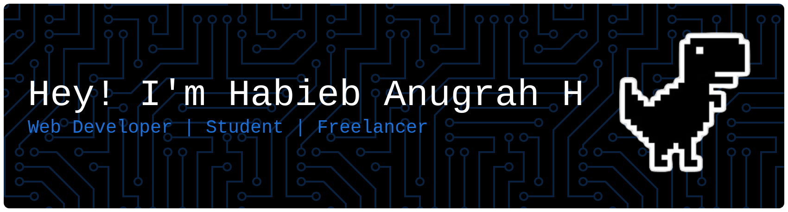

  

  

#### My Skills 

  

#### Connect With Me 
<a href="https://instagram.com/habib_ah13">       

#### My Github Stats  

  
  

#### Play With Me

<picture data-importer="pacman">
  <source media="(prefers-color-scheme: dark)" srcset="https://raw.githubusercontent.com/habiebanugrahh/habiebanugrahh/pacman-output/pacman-contribution-graph-dark.svg?game=pacman">
  <source media="(prefers-color-scheme: light)" srcset="https://raw.githubusercontent.com/habiebanugrahh/habiebanugrahh/pacman-output/pacman-contribution-graph.svg?game=pacman">
  
</picture>